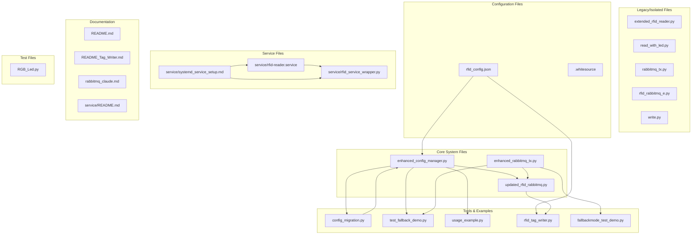

graph TB
    subgraph "Core System Files"
        ECM[enhanced_config_manager.py]
        ERMQ[enhanced_rabbitmq_tx.py]
        URRS[updated_rfid_rabbitmq.py]
    end
    
    subgraph "Legacy/Isolated Files"
        ERFR[extended_rfid_reader.py]
        RW[read_with_led.py]
        RTX[rabbitmq_tx.py]
        RRE[rfid_rabbitmq_e.py]
        WRITE[write.py]
    end
    
    subgraph "Configuration Files"
        CONFIG[rfid_config.json]
        WS[.whitesource]
    end
    
    subgraph "Tools & Examples"
        CM[config_migration.py]
        TFD[test_fallback_demo.py]
        UE[usage_example.py]
        RTW[rfid_tag_writer.py]
        FMT[fallbackmode_test_demo.py]
    end
    
    subgraph "Service Files"
        SERV[service/rfid-reader.service]
        WRAP[service/rfid_service_wrapper.py]
        SETUP[service/systemd_service_setup.md]
    end
    
    subgraph "Documentation"
        README[README.md]
        README_TAG[README_Tag_Writer.md]
        RMD[rabbitmq_claude.md]
        SREAD[service/README.md]
    end
    
    subgraph "Test Files"
        RGB[RGB_Led.py]
    end
    
    ECM --> URRS
    ECM --> CM
    ECM --> UE
    ECM --> TFD
    ERMQ --> URRS
    ERMQ --> TFD
    ERMQ --> FMT
    CONFIG --> ECM
    CONFIG --> RTW
    URRS --> RTW
    CM --> ECM
    SERV --> WRAP
    SETUP --> SERV
    SETUP --> WRAP# RFID Repository File Interaction Documentation

## System Architecture Overview

## Primary File Interactions

### Core System Components

#### 1. enhanced_config_manager.py (Central Configuration Hub)
**Role**: Central configuration management with validation and environment variable support
**Dependencies**: None (standalone)
**Used by**:
- `updated_rfid_rabbitmq.py` - Main scanner
- `config_migration.py` - Migration tool
- `usage_example.py` - Examples
- `test_fallback_demo.py` - Testing

**Key Features**:
- Type-safe configuration with dataclasses
- Environment variable overrides
- Configuration validation
- Statistics tracking
- Dynamic item management

#### 2. enhanced_rabbitmq_tx.py (Message Transmitter with Fallback)
**Role**: RabbitMQ messaging with automatic file fallback
**Dependencies**: 
- `pika` (RabbitMQ client)
- Standard libraries
**Used by**:
- `updated_rfid_rabbitmq.py` - Main scanner
- `test_fallback_demo.py` - Testing
- `fallbackmode_test_demo.py` - Demo

**Key Features**:
- Automatic fallback to file storage
- Background connection monitoring
- Status callbacks for LED indication
- Message queuing and recovery

#### 3. updated_rfid_rabbitmq.py (Main Scanner Application)
**Role**: Primary RFID scanner with LED status and RabbitMQ messaging
**Dependencies**:
- `enhanced_config_manager.py`
- `enhanced_rabbitmq_tx.py`
- `mfrc522`, `gpiozero`, `colorzero` (hardware)

**Key Features**:
- Complete RFID scanning workflow
- LED status indication
- Test mode support
- Command-line interface
- Fallback mode support

### Configuration and Migration

#### 4. config_migration.py (Migration Tool)
**Role**: Migrates old configuration format to new enhanced format
**Dependencies**:
- `enhanced_config_manager.py`
**Interactions**:
- Reads old `rfid_config.json`
- Creates backup files
- Validates migrated configuration

#### 5. rfid_config.json (Configuration Data)
**Role**: Central configuration file
**Used by**:
- All core components
- Migration tools
- Tag writer
- Examples

### Utility and Tools

#### 6. rfid_tag_writer.py (Tag Writing Tool)
**Role**: Interactive tool for writing RFID tags
**Dependencies**:
- Hardware libraries (`mfrc522`, `gpiozero`)
- `rfid_config.json` for item definitions

#### 7. test_fallback_demo.py & fallbackmode_test_demo.py (Testing Tools)
**Role**: Demonstrate and test fallback functionality
**Dependencies**:
- `enhanced_rabbitmq_tx.py`
- `enhanced_config_manager.py`

## Isolated Code (No Dependencies/Limited Use)

### 1. Extended RFID Reader (extended_rfid_reader.py)
**Status**: Isolated - early development version
**Issues**:
- Doesn't use enhanced configuration
- Basic functionality duplicated in main scanner
- Missing fallback capabilities

### 2. Simple Read with LED (read_with_led.py)
**Status**: Isolated - basic example
**Purpose**: Simple demonstration of RFID reading with LED
**Issues**:
- Hardcoded GPIO pins
- No configuration management
- Single-purpose utility

### 3. Basic Write Script (write.py)
**Status**: Isolated - contains syntax errors
**Issues**:
- Multiple syntax errors (`Rpi.GPIO` should be `RPi.GPIO`, `impot` should be `import`)
- No error handling
- Superseded by `rfid_tag_writer.py`

### 4. RGB LED Test (RGB_Led.py)
**Status**: Isolated - hardware testing only
**Purpose**: Test RGB LED functionality
**Issues**:
- Hardcoded GPIO pins
- Not integrated with configuration system

### 5. Legacy RabbitMQ Transmitter (rabbitmq_tx.py)
**Status**: Partially isolated - superseded by enhanced version
**Issues**:
- No fallback capability
- Missing status callbacks
- Superseded by `enhanced_rabbitmq_tx.py`

### 6. Service Wrapper (service/rfid_service_wrapper.py)
**Status**: Isolated - different architecture
**Issues**:
- Doesn't use enhanced configuration manager
- Different LED implementation
- Not compatible with main scanner

## Redundant Code

### 1. Multiple RFID Scanner Implementations
**Files with redundancy**:
- `extended_rfid_reader.py` - Basic version
- `rfid_rabbitmq_e.py` - Intermediate version
- `updated_rfid_rabbitmq.py` - Current enhanced version

**Redundant elements**:
- RFID reading logic duplicated across files
- LED control implementations
- Configuration loading patterns

### 2. RabbitMQ Implementation Variants
**Files with redundancy**:
- `rabbitmq_tx.py` - Basic version without fallback
- `enhanced_rabbitmq_tx.py` - Full-featured version

**Redundant elements**:
- Connection management code
- Message transmission logic
- Logging setup

### 3. Configuration Management
**Files with redundancy**:
- `rfid_tag_writer.py` has its own `ConfigManager` class
- Service wrapper has custom config loading
- Multiple files parse `rfid_config.json` independently

### 4. LED Control Logic
**Redundant implementations in**:
- `RGB_Led.py` - Basic test
- `extended_rfid_reader.py` - Integrated version
- `updated_rfid_rabbitmq.py` - Enhanced version
- Service wrapper - Custom implementation

## Service Architecture

### Service Components (Separate System)
The service directory contains a separate systemd service implementation:

**Files**:
- `service/rfid-reader.service` - Systemd service definition
- `service/rfid_service_wrapper.py` - Service wrapper script
- `service/systemd_service_setup.md` - Setup instructions
- `service/README.md` - Service documentation

**Isolation Issues**:
- Uses different architecture than main scanner
- Doesn't leverage enhanced configuration manager
- Separate LED implementation
- Not compatible with fallback messaging system

## Documentation and Examples

### Documentation Files
- `README.md` - Main system documentation
- `README_Tag_Writer.md` - Hardware setup guide
- `rabbitmq_claude.md` - Development conversation history

### Example Files
- `usage_example.py` - Configuration manager examples
- Interactive demos and testing utilities

## Recommendations for Cleanup

### 1. Remove Isolated/Obsolete Files
**Files to consider removing**:
- `write.py` (syntax errors, superseded)
- `extended_rfid_reader.py` (superseded by main scanner)
- `read_with_led.py` (basic example only)
- `rfid_rabbitmq_e.py` (intermediate version)
- `RGB_Led.py` (test utility only)

### 2. Consolidate Redundant Code
**Actions needed**:
- Standardize on `enhanced_config_manager.py` for all configuration
- Update service wrapper to use enhanced configuration
- Remove `rabbitmq_tx.py` in favor of enhanced version
- Consolidate LED control logic

### 3. Update Service Architecture
**Improvements needed**:
- Update service wrapper to use enhanced configuration manager
- Integrate with enhanced RabbitMQ transmitter
- Add fallback capability to service
- Standardize LED implementation

### 4. Configuration Standardization
**Actions needed**:
- Update `rfid_tag_writer.py` to use enhanced configuration manager
- Remove custom configuration parsers
- Migrate all components to use centralized configuration

## File Status Summary

| File | Status | Purpose | Dependencies | Recommendation |
|------|--------|---------|--------------|----------------|
| `enhanced_config_manager.py` | ✅ Current | Core config management | None | Keep - central component |
| `enhanced_rabbitmq_tx.py` | ✅ Current | Message transmission with fallback | Standard libs | Keep - core component |
| `updated_rfid_rabbitmq.py` | ✅ Current | Main scanner application | Enhanced managers | Keep - main application |
| `config_migration.py` | ✅ Current | Migration utility | Enhanced config | Keep - useful utility |
| `rfid_tag_writer.py` | 🔄 Needs update | Tag writing tool | Hardware libs | Update to use enhanced config |
| `extended_rfid_reader.py` | ❌ Obsolete | Early scanner version | Hardware libs | Remove - superseded |
| `rabbitmq_tx.py` | ❌ Obsolete | Basic transmitter | RabbitMQ libs | Remove - superseded |
| `write.py` | ❌ Broken | Basic write script | Hardware libs | Remove - syntax errors |
| `RGB_Led.py` | ❌ Test only | LED testing | Hardware libs | Remove - test utility |
| `service/` files | 🔄 Needs update | Systemd service | Various | Update to use enhanced components |

This analysis shows the repository has evolved significantly, with newer enhanced components superseding older implementations. A cleanup focusing on the recommendations above would streamline the codebase considerably.
